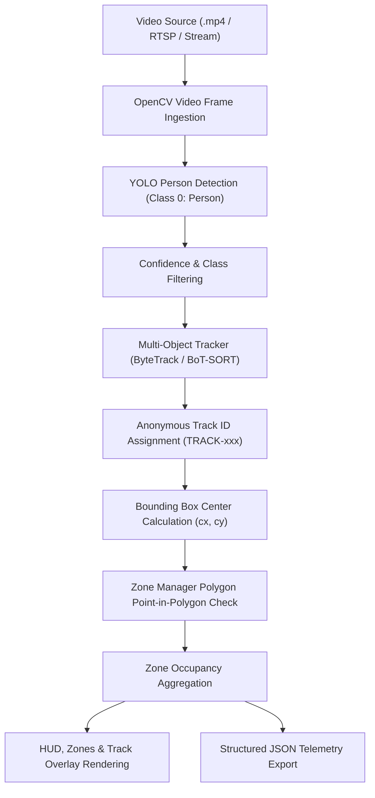

# Phase 1 — Computer Vision Foundation Documentation

## 1. Phase 1 Objective
Phase 1 establishes the real-time computer vision foundation for the **Smart Store Safety & Operations Intelligence System**. It ingests retail video/CCTV feeds, performs deep-learning-based person detection, applies persistent anonymous tracking, maps detected individuals to configurable store zones, computes live occupancy metrics per zone, and exports structured JSON telemetry for downstream event intelligence engines (Phase 2).

---

## 2. Architecture & Pipeline Flow

The Phase 1 pipeline executes the following sequence:



---

## 3. Technologies Used
- **Language**: Python 3.10+ (tested on Python 3.13)
- **Computer Vision**: OpenCV (`cv2`) 4.13+
- **Deep Learning**: Ultralytics YOLOv8 / PyTorch 2.x
- **Multi-Object Tracking**: ByteTrack / BoT-SORT / LAP (Linear Assignment Problem)
- **Numerical Processing**: NumPy
- **Unit Testing**: Pytest 8.x
- **Data Serialization**: JSON

---

## 4. Installation & Setup

1. **Clone and navigate to repository**:
   ```bash
   cd "c:\Users\275680\Desktop\java project v2"
   ```

2. **Install Python dependencies**:
   ```bash
   pip install -r requirements.txt
   ```

---

## 5. Configuration Guide

All pipeline settings are centralized in [`ml/config/vision_config.json`](file:///c:/Users/275680/Desktop/java%20project%20v2/ml/config/vision_config.json):

```json
{
  "camera_id": "CAM-01",
  "model_path": "yolov8n.pt",
  "confidence_threshold": 0.40,
  "tracker_type": "bytetrack.yaml",
  "video_source": "datasets/sample/sample_cctv.mp4",
  "output_json_path": "outputs/vision_results.json",
  "output_video_path": "outputs/annotated_stream.mp4",
  "sample_interval": 1,
  "frame_skip": 1,
  "display": false,
  "zones": [
    {
      "zone_id": "ENTRANCE",
      "name": "Store Entrance",
      "type": "ENTRANCE",
      "points": [[20, 350], [200, 350], [200, 950], [20, 950]],
      "color": [255, 200, 0]
    },
    {
      "zone_id": "AISLE-A",
      "name": "Aisle A (Retail)",
      "type": "AISLE",
      "points": [[210, 350], [400, 350], [400, 950], [210, 950]],
      "color": [0, 255, 128]
    },
    {
      "zone_id": "CHECKOUT-01",
      "name": "Checkout Counter",
      "type": "CHECKOUT",
      "points": [[620, 350], [800, 350], [800, 950], [620, 950]],
      "color": [255, 128, 0]
    },
    {
      "zone_id": "RESTRICTED",
      "name": "Backroom / Storage",
      "type": "RESTRICTED",
      "points": [[0, 0], [810, 0], [810, 320], [0, 320]],
      "color": [0, 0, 255]
    }
  ]
}
```

---

## 6. Running Instructions

### Basic Run with Sample Video
```bash
python run_vision.py --source datasets/sample/sample_cctv.mp4
```

### Run with Custom Camera ID and Output Recording
```bash
python run_vision.py \
    --source datasets/sample/sample_cctv.mp4 \
    --camera-id CAM-01 \
    --save-video \
    --output-video outputs/annotated_stream.mp4 \
    --output-json outputs/vision_results.json
```

### Live Visual Monitoring Window
```bash
python run_vision.py --source datasets/sample/sample_cctv.mp4 --show
```

---

## 7. Modular Components

### 7.1 Person Detection ([`ml/detection/person_detector.py`](file:///c:/Users/275680/Desktop/java%20project%20v2/ml/detection/person_detector.py))
- Uses YOLOv8 nano/small models.
- Filters strictly for COCO class index `0` (`person`).
- Configurable confidence threshold (default: `0.40`).
- Provides clean `[x1, y1, x2, y2]` bounding boxes and calculated center points.

### 7.2 Person Tracking ([`ml/tracking/person_tracker.py`](file:///c:/Users/275680/Desktop/java%20project%20v2/ml/tracking/person_tracker.py))
- Supports ByteTrack and BoT-SORT tracking engines.
- Formats IDs anonymously: `TRACK-001`, `TRACK-002`, `TRACK-003`.
- Strict privacy adherence: No facial recognition, biometric storage, or age/gender estimation.
- Built-in IoU fallback tracker for unit testing and offline environments.

### 7.3 Store Zones & Occupancy ([`ml/zones/zone_manager.py`](file:///c:/Users/275680/Desktop/java%20project%20v2/ml/zones/zone_manager.py))
- Arbitrary convex/concave polygon zone geometries.
- Ray casting / `cv2.pointPolygonTest` point containment test.
- Person center-to-zone assignment.
- Unique track counting per zone per frame.

### 7.4 Structured JSON Telemetry ([`ml/output/json_exporter.py`](file:///c:/Users/275680/Desktop/java%20project%20v2/ml/output/json_exporter.py))
Output format produced for Phase 2:
```json
[
  {
    "timestamp": "2026-09-24T22:33:43.533525",
    "camera_id": "CAM-01",
    "frame_number": 1,
    "tracks": [
      {
        "track_id": "TRACK-001",
        "bbox": [48, 400, 245, 904],
        "confidence": 0.878,
        "center": [146, 652],
        "zone_id": "ENTRANCE"
      },
      {
        "track_id": "TRACK-002",
        "bbox": [221, 409, 344, 860],
        "confidence": 0.846,
        "center": [282, 634],
        "zone_id": "AISLE-A"
      },
      {
        "track_id": "TRACK-003",
        "bbox": [670, 397, 809, 878],
        "confidence": 0.838,
        "center": [739, 637],
        "zone_id": "CHECKOUT-01"
      }
    ],
    "zone_counts": {
      "ENTRANCE": 1,
      "AISLE-A": 1,
      "CHECKOUT-01": 1,
      "RESTRICTED": 0
    }
  }
]
```

---

## 8. Verification & Testing

### Test Suite Execution
Execute all 18 automated unit and integration tests:
```bash
python -m pytest -v
```

Test coverage includes:
1. **Center Calculation**: Bounding box center coordinates and odd dimension rounding.
2. **Zone Containment**: Inside, outside, and boundary point tests.
3. **Zone Assignment & Counting**: Multi-track assignment, unique ID aggregation, unassigned track handling.
4. **Configuration Validation**: Schema validation, missing file handling, duplicate zone ID protection.
5. **Pipeline Integration**: JSON serialization, error boundaries, empty frame assertions.

---

## 9. Current Limitations
- Frame processing rate on CPU is ~3-4 FPS with YOLOv8n + ByteTrack (GPU acceleration with CUDA/TensorRT increases throughput significantly).
- Camera calibration / perspective distortion correction is planar 2D.
- Occlusion recovery duration depends on ByteTrack's max buffer window.

---

## 10. Phase 2 Integration Point
Phase 2 (Store Intelligence & Alert Engine) will directly consume the telemetry stream produced by Phase 1:
- `zone_counts` -> Crowd Density Rule Engine (`CROWD_DENSITY`)
- `CHECKOUT` zone occupancy & duration -> Checkout Queue Congestion Engine (`QUEUE_CONGESTION`)
- `RESTRICTED` zone tracks -> Unauthorized Access Alerting (`RESTRICTED_AREA_ENTRY`)
- Track velocity & stationary duration -> Obstruction Detection (`AISLE_OBSTRUCTION`)
