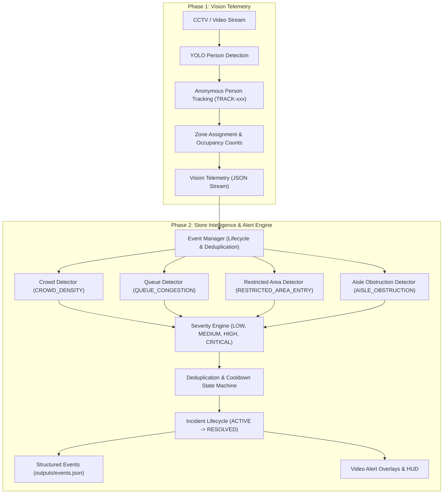

# Phase 2 — Store Intelligence & Alert Engine Documentation

## 1. Phase 2 Objective
Phase 2 transforms raw Phase 1 computer vision telemetry (person tracks, bounding boxes, center coordinates, and zone occupancy counts) into actionable store operations events. It adds real-time detection for crowd surges, checkout queue congestion, restricted area intrusions, and aisle obstructions, with configurable severity scoring, event deduplication, incident lifecycle management, and structured JSON event export.

---

## 2. Architecture & Data Flow



---

## 3. Core Event Types

| Event Type | Target Zones | Primary Detection Heuristic | Default Severity |
|---|---|---|---|
| `CROWD_DENSITY` | `AISLE`, `ENTRANCE`, Common Areas | Occupancy count exceeds zone density thresholds for $\ge N$ persistent frames | `LOW`, `MEDIUM`, `HIGH`, `CRITICAL` (dynamic) |
| `QUEUE_CONGESTION` | `CHECKOUT-01`, `CHECKOUT-02` | Customer count in checkout lane exceeds queue thresholds for $\ge N$ persistent frames | `LOW`, `MEDIUM`, `HIGH`, `CRITICAL` (dynamic) |
| `RESTRICTED_AREA_ENTRY` | `RESTRICTED` (Backrooms, Storage) | Any anonymous track (`TRACK-xxx`) detected inside restricted polygon | `HIGH` (scales to `CRITICAL` if prolonged) |
| `AISLE_OBSTRUCTION` | `AISLE` zones | Stationary cluster of persons with low displacement ($\le 20\text{px}$) for $\ge N$ frames (Prototype rule) | `MEDIUM` / `HIGH` |

---

## 4. Structured Event Model & JSON Schema

All events conform to the specification defined in [`datasets/sample/schemas/event_schema.json`](file:///c:/Users/275680/Desktop/java%20project%20v2/datasets/sample/schemas/event_schema.json):

```json
{
  "event_id": "EVT-20260925-0001",
  "event_type": "CROWD_DENSITY",
  "camera_id": "CAM-01",
  "zone_id": "AISLE-A",
  "timestamp": "2026-09-25T10:15:08",
  "severity": "HIGH",
  "status": "ACTIVE",
  "description": "High crowd density (11 people, HIGH severity) detected in Aisle A (Groceries)",
  "people_count": 11,
  "details": {
    "start_frame": 8,
    "last_frame": 15,
    "duration_frames": 10
  }
}
```

---

## 5. Event Lifecycle & Deduplication Logic

1. **Unique Event Key**:
   - General Events: `f"{event_type}:{camera_id}:{zone_id}"`
   - Target-specific Events (Restricted Entry): `f"{event_type}:{camera_id}:{zone_id}:{track_id}"`
2. **Deduplication**:
   - If an event is already `ACTIVE` for a key, incoming candidate frames update the existing event (`people_count`, `severity`, `duration_frames`) rather than creating duplicate event records.
3. **Resolution**:
   - When the triggering condition clears (e.g. crowd dissipates or intruder leaves), the event transitions to `RESOLVED`, sets `resolved_at`, and enters a configurable `cooldown_frames` window to prevent alert flapping.

---

## 6. Configuration Guide

All intelligence parameters are centralized in [`ml/config/intelligence_config.json`](file:///c:/Users/275680/Desktop/java%20project%20v2/ml/config/intelligence_config.json):

```json
{
  "camera_id": "CAM-01",
  "cooldown_frames": 15,
  "output_events_path": "outputs/events.json",
  "crowd_density": {
    "enabled": true,
    "persistence_frames": 5,
    "thresholds": {
      "AISLE": { "low": 5, "medium": 8, "high": 12, "critical": 18 },
      "ENTRANCE": { "low": 6, "medium": 10, "high": 15, "critical": 22 }
    }
  },
  "queue_congestion": {
    "enabled": true,
    "persistence_frames": 5,
    "thresholds": {
      "CHECKOUT-01": { "low": 3, "medium": 5, "high": 8, "critical": 12 }
    }
  },
  "restricted_area": {
    "enabled": true,
    "default_severity": "HIGH"
  },
  "aisle_obstruction": {
    "enabled": true,
    "persistence_frames": 15,
    "min_stationary_count": 2,
    "max_movement_px": 20.0
  }
}
```

---

## 7. Running Instructions

### Run Intelligence Engine on Existing Vision Telemetry
```bash
python run_intelligence.py \
    --input outputs/vision_results.json \
    --output outputs/events.json \
    --config ml/config/intelligence_config.json
```

### Run Unified Live Stream (Vision + Intelligence + Video Alert Overlays)
```bash
python run_store_intelligence.py \
    --source datasets/sample/sample_cctv.mp4 \
    --camera-id CAM-01 \
    --save-video \
    --output-video outputs/annotated_stream.mp4 \
    --output-json outputs/vision_results.json \
    --output-events outputs/events.json
```

---

## 8. Automated Testing & Verification

Run the complete test suite (36 tests):
```bash
python -m pytest -v
```

Test coverage includes:
- **Phase 1 Regression** (18 tests): Center calculations, IoU tracking, zone geometry, counting, and pipeline.
- **Phase 2 Intelligence** (18 tests):
  - `test_severity_engine.py`: Dynamic severity thresholds and calculations.
  - `test_crowd_detector.py`: Thresholds, persistence windows, and crowd resolution.
  - `test_queue_detector.py`: Checkout queue congestion detection and resolution.
  - `test_restricted_area_detector.py`: Intrusion entry, continuous dwell, and exit resolution.
  - `test_obstruction_detector.py`: Stationary clustering vs moving traffic heuristics.
  - `test_event_manager.py`: ID generation, deduplication, cooldown suppression, and state persistence.
  - `test_intelligence_pipeline.py`: Full telemetry integration and schema compliance.

---

## 9. Limitations & Technical Honesty

- **Aisle Obstruction**: The current implementation detects stationary human clusters blocking aisles using occupancy and displacement heuristics. It does **not** perform physical object detection (e.g., dropped pallets or cardboard boxes) without an additional physical object classification model.
- **Environmental Safety**: Fire, smoke, and fall detection require dedicated classification/pose models and are not part of Phase 2.
- **Camera Calibration**: Spatial calculations are 2D image-space pixels rather than 3D bird's-eye transformed metric coordinates.

---

## 10. Phase 3 Readiness

The event output in [`outputs/events.json`](file:///c:/Users/275680/Desktop/java%20project%20v2/outputs/events.json) contains all attributes required for direct insertion into MySQL and exposure via FastAPI in Phase 3:
- `event_id` (Primary key)
- `event_type`
- `camera_id`
- `zone_id`
- `track_id`
- `timestamp`
- `severity`
- `status`
- `description`
- `people_count`
- `details`
- `resolved_at`
