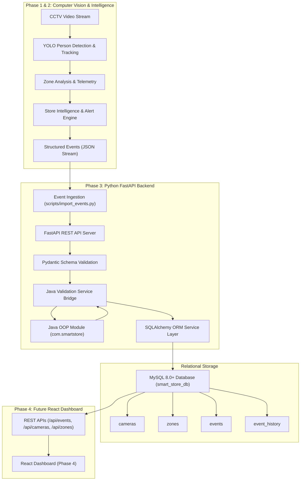

# Phase 3 — Backend, Database & Java Business Module Documentation

## 1. Phase 3 Objective
Phase 3 builds the enterprise backend layer for the **Smart Store Safety & Operations Intelligence System**. It establishes a high-performance **Python FastAPI** REST API for incident querying and status management, a **MySQL 8.0+** relational database (with SQLite fallback for development and testing) to persist cameras, zones, events, and audit histories, and a lightweight **Java OOP Business Validation Module** that validates incident domain rules before database ingestion.

---

## 2. Full Architecture & Data Flow



---

## 3. Technology Stack

- **Primary Backend Framework**: FastAPI 0.137+ / Uvicorn (Python 3.13)
- **Object Relational Mapping (ORM)**: SQLAlchemy 2.0+
- **Database**: MySQL 8.0+ (with SQLite fallback for zero-configuration testing)
- **Data Validation & Typing**: Pydantic 2.13+
- **Supporting Business Logic**: Java 17+ / Java 21 LTS (OOP domain rules)
- **Testing**: Pytest 8.4+ & Java Unit Test Harness

---

## 4. REST API Specification

### Base URL: `/api`

| Method | Endpoint | Description | Query Parameters / Body |
|---|---|---|---|
| `GET` | `/api/health` | Health check reporting service status and DB connectivity | None |
| `GET` | `/api/cameras` | List registered store CCTV cameras | `?status=ACTIVE` |
| `GET` | `/api/cameras/{camera_id}` | Retrieve specific camera metadata | None |
| `POST` | `/api/cameras` | Register or update a camera | `CameraCreate` JSON body |
| `GET` | `/api/zones` | List configured store zones | `?camera_id=CAM-01&zone_type=AISLE` |
| `GET` | `/api/zones/{zone_id}` | Retrieve specific zone geometry and details | None |
| `POST` | `/api/zones` | Register or update a zone | `ZoneCreate` JSON body |
| `GET` | `/api/events` | List historical and active incidents | `?status=&severity=&event_type=&camera_id=&zone_id=&limit=&offset=` |
| `GET` | `/api/events/active` | List all unresolved/active incidents for live dashboard | `?limit=100` |
| `GET` | `/api/events/{event_id}` | Retrieve single event with its full lifecycle history | None |
| `POST` | `/api/events` | Ingest new event (validated by Java business module) | `EventCreate` JSON body |
| `PATCH` | `/api/events/{event_id}/status` | Update lifecycle status (`ACTIVE`, `ACKNOWLEDGED`, `RESOLVED`) | `{"status": "RESOLVED", "changed_by": "OPERATOR"}` |

### Interactive Documentation
- **Swagger UI**: `http://localhost:8000/docs`
- **ReDoc UI**: `http://localhost:8000/redoc`

---

## 5. MySQL Relational Schema

Defined in [`database/schemas/schema.sql`](file:///c:/Users/275680/Desktop/java%20project%20v2/database/schemas/schema.sql):

### 1. `cameras` Table
```sql
CREATE TABLE cameras (
    camera_id VARCHAR(50) PRIMARY KEY,
    camera_name VARCHAR(100) NOT NULL,
    location VARCHAR(255),
    stream_source VARCHAR(500),
    status VARCHAR(30) DEFAULT 'ACTIVE',
    created_at TIMESTAMP DEFAULT CURRENT_TIMESTAMP
);
```

### 2. `zones` Table
```sql
CREATE TABLE zones (
    zone_id VARCHAR(50) PRIMARY KEY,
    zone_name VARCHAR(100) NOT NULL,
    zone_type VARCHAR(50) NOT NULL,
    camera_id VARCHAR(50),
    description VARCHAR(255),
    FOREIGN KEY (camera_id) REFERENCES cameras(camera_id) ON DELETE SET NULL
);
```

### 3. `events` Table
```sql
CREATE TABLE events (
    event_id VARCHAR(50) PRIMARY KEY,
    event_type VARCHAR(50) NOT NULL,
    camera_id VARCHAR(50) NOT NULL,
    zone_id VARCHAR(50),
    track_id VARCHAR(50),
    timestamp DATETIME NOT NULL,
    severity VARCHAR(20) NOT NULL,
    status VARCHAR(20) NOT NULL DEFAULT 'ACTIVE',
    description TEXT,
    people_count INT,
    details JSON,
    resolved_at DATETIME,
    created_at TIMESTAMP DEFAULT CURRENT_TIMESTAMP,
    updated_at TIMESTAMP DEFAULT CURRENT_TIMESTAMP ON UPDATE CURRENT_TIMESTAMP,
    FOREIGN KEY (camera_id) REFERENCES cameras(camera_id) ON DELETE CASCADE,
    FOREIGN KEY (zone_id) REFERENCES zones(zone_id) ON DELETE SET NULL
);
```

### 4. `event_history` Table
```sql
CREATE TABLE event_history (
    history_id BIGINT AUTO_INCREMENT PRIMARY KEY,
    event_id VARCHAR(50) NOT NULL,
    old_status VARCHAR(20),
    new_status VARCHAR(20) NOT NULL,
    changed_at DATETIME DEFAULT CURRENT_TIMESTAMP,
    changed_by VARCHAR(100) DEFAULT 'SYSTEM',
    FOREIGN KEY (event_id) REFERENCES events(event_id) ON DELETE CASCADE
);
```

---

## 6. Java OOP Business Validation Module

The Java module resides in [`java-module/`](file:///c:/Users/275680/Desktop/java%20project%20v2/java-module/) and demonstrates core Object-Oriented Programming (OOP) concepts:

### Key OOP Principles Demonstrated:
1. **Encapsulation**: Private fields, getters, setters, constructors in [`StoreEvent.java`](file:///c:/Users/275680/Desktop/java%20project%20v2/java-module/src/main/java/com/smartstore/model/StoreEvent.java) and [`ValidationResult.java`](file:///c:/Users/275680/Desktop/java%20project%20v2/java-module/src/main/java/com/smartstore/model/ValidationResult.java).
2. **Polymorphism & Interfaces**: [`BusinessRule.java`](file:///c:/Users/275680/Desktop/java%20project%20v2/java-module/src/main/java/com/smartstore/validation/BusinessRule.java) interface implemented by [`BasicStructureRule`](file:///c:/Users/275680/Desktop/java%20project%20v2/java-module/src/main/java/com/smartstore/validation/BasicStructureRule.java), [`CrowdBusinessRule`](file:///c:/Users/275680/Desktop/java%20project%20v2/java-module/src/main/java/com/smartstore/validation/CrowdBusinessRule.java), [`RestrictedAreaBusinessRule`](file:///c:/Users/275680/Desktop/java%20project%20v2/java-module/src/main/java/com/smartstore/validation/RestrictedAreaBusinessRule.java), and [`QueueBusinessRule`](file:///c:/Users/275680/Desktop/java%20project%20v2/java-module/src/main/java/com/smartstore/validation/QueueBusinessRule.java).
3. **Custom Exception Handling**: [`InvalidEventException.java`](file:///c:/Users/275680/Desktop/java%20project%20v2/java-module/src/main/java/com/smartstore/exception/InvalidEventException.java).
4. **Composite Validation Pattern**: [`EventValidator.java`](file:///c:/Users/275680/Desktop/java%20project%20v2/java-module/src/main/java/com/smartstore/validation/EventValidator.java) iterates over registered rule instances.

### Python ↔ Java Integration Mechanism:
- When an event is ingested via `POST /api/events` or `scripts/import_events.py`, [`JavaValidationService`](file:///c:/Users/275680/Desktop/java%20project%20v2/backend/app/services/java_validation_service.py) converts the payload to JSON and invokes `java -cp java-module/bin com.smartstore.Main --json '<payload>'`.
- The Java process applies domain business rules and returns structured JSON:
  ```json
  {"valid": true, "event_id": "EVT-20260925-0001", "message": "Event passed all business validation rules."}
  ```
- If validation fails, Java returns:
  ```json
  {"valid": false, "event_id": "EVT-20260925-0001", "message": "A crowd count of 20 people exceeds critical thresholds and cannot be assigned LOW severity.", "rule_violated": "CrowdBusinessRule"}
  ```
  FastAPI then raises an HTTP `422 Unprocessable Entity` with the exact violation details.

---

## 7. How to Run

### 1. Compile Java Validation Module
```bash
# Compile Java classes to bin/
javac -d "java-module/bin" java-module/src/main/java/com/smartstore/model/*.java java-module/src/main/java/com/smartstore/exception/*.java java-module/src/main/java/com/smartstore/validation/*.java java-module/src/main/java/com/smartstore/Main.java

# Run Java standalone unit tests
javac -d "java-module/bin" -cp "java-module/bin" java-module/src/test/java/com/smartstore/*.java
java -cp "java-module/bin" com.smartstore.ValidationTest
```

### 2. Run FastAPI Backend Server
```bash
python -m uvicorn backend.app.main:app --host 0.0.0.0 --port 8000 --reload
```

### 3. Ingest Events into Database
```bash
python scripts/import_events.py --file outputs/events.json
```

---

## 8. Testing & Verification

Run the entire automated test suite:
```bash
python -m pytest -v
```

### Test Suite Overview:
- **Phase 1 Regression** (18 tests): Bounding boxes, centers, IoU tracking, zone assignment, occupancy counting.
- **Phase 2 Regression** (18 tests): Crowd thresholds, checkout queue congestion, restricted area entries, aisle obstruction, severity calculations, event lifecycle, and cooldown windows.
- **Phase 3 Backend & Integration** (11 tests):
  - `test_backend_api.py`: Health check, camera APIs, zone APIs, event creation, event status patching, audit trail logging, and Java validation rejection.
  - `test_database.py`: SQLAlchemy ORM entity relationships, cascades, and constraints.
  - `test_java_integration.py`: End-to-end Python-to-Java subprocess execution.

**Total Result: 47 / 47 tests passed (Python) + 10 / 10 tests passed (Java)**.

---

## 9. Example API Responses

### `GET /api/health`
```json
{
  "status": "healthy",
  "service": "smart-store-backend",
  "database": "connected"
}
```

### `GET /api/events/active`
```json
[
  {
    "event_id": "EVT-20260925-0001",
    "event_type": "CROWD_DENSITY",
    "camera_id": "CAM-01",
    "zone_id": "AISLE-A",
    "track_id": null,
    "timestamp": "2026-09-25T10:15:08",
    "severity": "HIGH",
    "status": "ACTIVE",
    "description": "High crowd density (11 people, HIGH severity) detected in Aisle A (Groceries)",
    "people_count": 11,
    "details": {
      "start_frame": 8,
      "last_frame": 15,
      "duration_frames": 10
    }
  }
]
```

### `PATCH /api/events/EVT-20260925-0001/status`
Request:
```json
{
  "status": "RESOLVED",
  "changed_by": "STORE_MANAGER"
}
```
Response:
```json
{
  "event_id": "EVT-20260925-0001",
  "event_type": "CROWD_DENSITY",
  "camera_id": "CAM-01",
  "zone_id": "AISLE-A",
  "status": "RESOLVED",
  "resolved_at": "2026-09-25T10:20:15",
  "history": [
    {"history_id": 1, "event_id": "EVT-20260925-0001", "old_status": null, "new_status": "ACTIVE", "changed_by": "SYSTEM"},
    {"history_id": 2, "event_id": "EVT-20260925-0001", "old_status": "ACTIVE", "new_status": "RESOLVED", "changed_by": "STORE_MANAGER"}
  ]
}
```

---

## 10. Phase 4 Readiness

The FastAPI backend is fully configured for Phase 4 (React Dashboard):
- **CORS Enabled**: Configured for `http://localhost:3000` and `http://localhost:5173` (Vite/React).
- **Polling & Live Telemetry**: `GET /api/events/active` provides instant polling for active incidents.
- **Audit Logging**: `GET /api/events/{id}` returns complete incident lifecycle history for dashboard timeline views.
- **Store Configuration**: `GET /api/cameras` and `GET /api/zones` provide metadata for camera grid cards and store zone floorplans.
